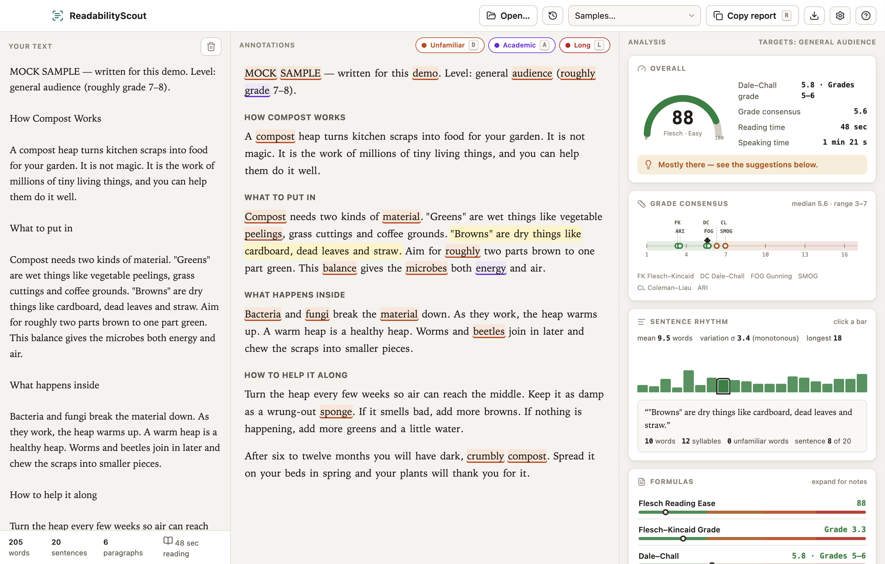

# ReadabilityScout



Analyse the readability of any text on your Mac or PC — plain text, Markdown,
PDF, and Word documents. Eight established formulas, a grade-consensus scale,
an interactive sentence-rhythm strip, readability-principles checks, and
annotations that show you *which* words and sentences are the problem — all in
a native desktop window.

The analysis engine and design come from the readability tool demo at
`~/agent-demos/kimi-k3-readability-test`; ReadabilityScout is that tool as a
proper Mac app in the scout family.

## Run it

**Packaged app** (already built): `release/mac-arm64/ReadabilityScout.app` —
move it to `/Applications` if you like. It is unsigned; on first launch,
right-click → Open, or approve it in System Settings → Privacy & Security.

**From source**:

```bash
bun install
bun run dev        # live-reload development
bun run pack       # rebuild release/mac-arm64/ReadabilityScout.app
bun run test:smoke # end-to-end check: launch, open file, render, settings
```

## Use it

- **⌘O** opens any text file — including **PDF** and **Word (.docx)**, whose
  text is extracted in memory (layout ignored; legacy `.doc` gets a clear
  message). The app follows changes on disk: if you edit the file in another
  editor, the analysis reloads silently — unless you have typed over the buffer
  here, in which case a "changed on disk" pill offers a reload.
  The app never writes to your files (ADR 0002).
- **Markdown stays honest.** Image syntax, URLs and HTML tags never count as
  words or sentences — `` is ignored while the caption
  beside it is analysed. The reader shows your raw text; the metrics see prose.
- A **Principles card** checks the computable readability principles: heading
  density, lists, long comma sequences (list candidates), opens-with-welcome,
  verbs-over-nouns (nominalisation density), and reader address. These feed the
  suggestions alongside the formula-based ones.
- The **recents menu** (clock icon) re-opens the last 12 files.
- Paste or type directly for scratch analysis; the four bundled mock samples
  (keys **1–4**) show the range from grade 4 to dense officialese.
- Click a **rhythm bar** to jump to that sentence; click a **word** in the
  vocabulary list to flash every occurrence.
- **?** shows every shortcut. Settings (audience targets, theme, annotation
  layers, thresholds) live in the gear drawer and every change is recorded in
  a changelog with a one-click reset.
- **R** copies a Markdown report; the download button saves the full analysis
  as JSON where you choose.

## Where things live

| Path | Role |
|---|---|
| `src/main/` | Window, menu, file dialog/reading/watching, PDF/DOCX extraction, settings + recents store |
| `src/preload/` | Typed `window.rs` IPC bridge |
| `src/shared/ipc.ts` | Channel names and shared types |
| `src/renderer/src/analysis/` | Engine (pure TS port), generated word lists + samples, insights |
| `src/renderer/src/components/` | AppBar, EditorPane, ReaderPane, Dashboard, SettingsDrawer, HelpModal |
| `src/renderer/src/styles.css` | Design ported verbatim from the demo + desktop additions |
| `scripts/build-data.mjs` | Regenerates word lists/samples from the agent-demos tool |
| `e2e/smoke.mjs` | Playwright end-to-end smoke test |
| `docs/` | PRD, ADRs, quality-gate walkthrough |

## Privacy

No network calls, no telemetry. Files are read, never written. Settings and
recents live in Electron's `userData` folder; exports go only where you put
them.
